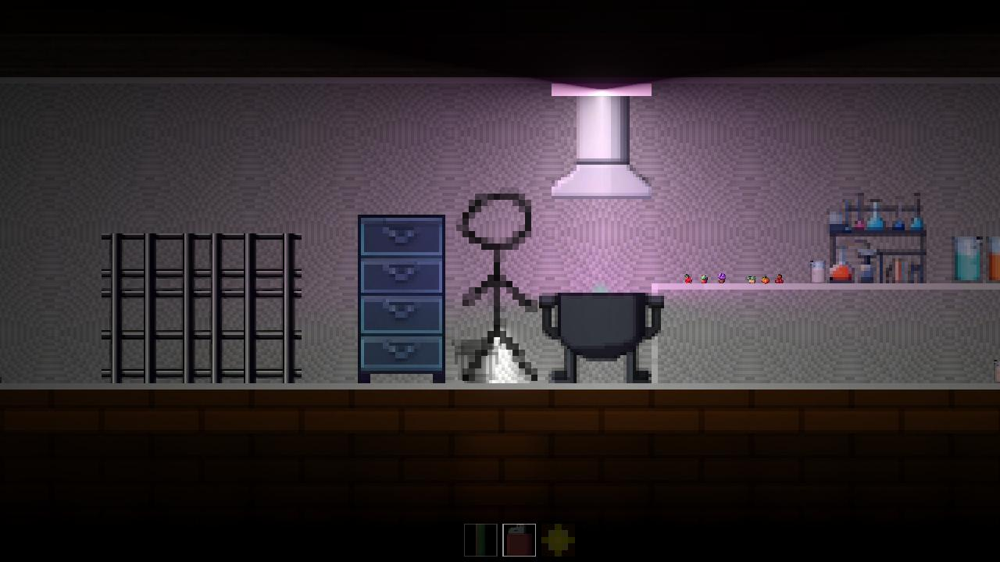
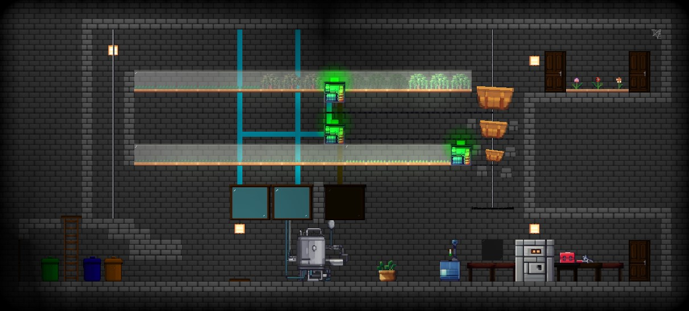
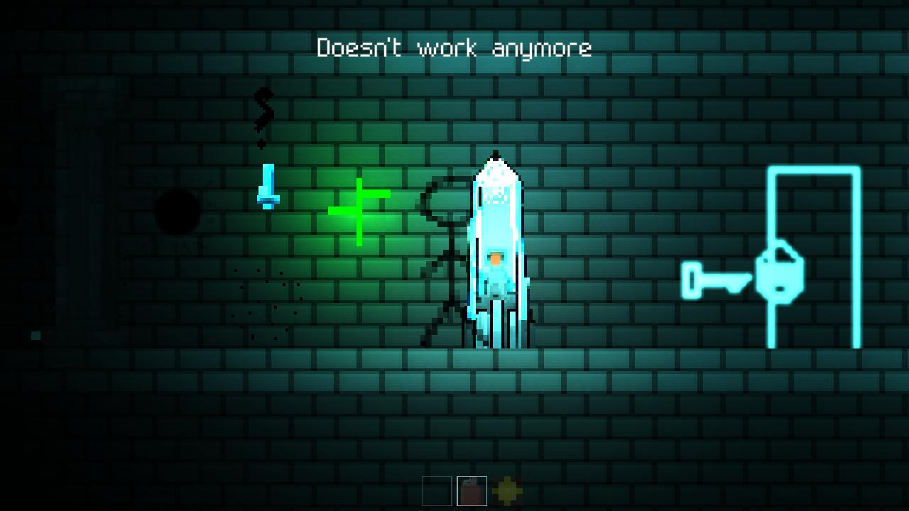

# Cattubi Manor

**2D platformer | Unity [C#] | projekt solo**

Cattubi Manor to dwuwymiarowa gra platformowa tworzona samodzielnie w Unity. Projekt obejmował pełny proces produkcji: od pierwszego prototypu, przez implementację mechanik, aż po grywalną wersję (~70% ukończenia).

Projekt został porzucony na etapie dopracowywania warstwy wizualnej (animacje, finalna oprawa graficzna), po osiągnięciu celów edukacyjnych.

---

## Moja rola
- projektowanie i implementacja mechanik gry
- system ruchu postaci i kolizji
- tworzenie poziomów, scen i UI
- testowanie, naprawa błędów i iteracyjne poprawki

---

## Podgląd

### Screenshoty

### Wideo

---

## Status projektu
- Projekt edukacyjny  
- Wersja grywalna ukończona w ok. 70%  

**Kod źródłowy nieudostępniony** (projekt zawiera treści NSFW)
